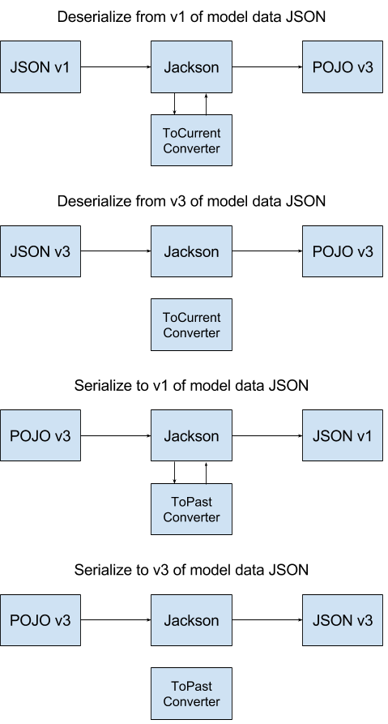

# Jackson Model Versioning Module
Jackson 2.x module for handling versioning of models.

## The Problem
Let's say we create an API that accepts the following car data JSON:
```json
{
  "model": "honda:civic",
  "year": 2016,
  "new": "true"
}
```

Later, we decide that `model` should be split into two fields (`make` and `model`).
```json
{
  "make": "honda",
  "model": "civic",
  "year": 2016,
  "new": "true"
}
```

Then we decide that `new` should be actually be retyped and renamed (boolean `used`).
```json
{
  "make": "honda",
  "model": "civic",
  "year": 2016,
  "used": false
}
```

By this point, we have three formats of data that clients might be sending to or requesting from our API. Hopefully we had the foresight to implement versioning on the models or API call's parameters.

There are at least a few ways to handle versioning of data for on an API. A decently clean way is to create new classes for each version of the model and use API parameters (ex. HTTP URL or headers) to specify the version of the data. Then write some custom logic to inform the framework of which class that version of the data should bind to.
```
POST /api/car/v1/     <-  CarV1
GET  /api/car/v1/     ->  List<CarV1>
GET  /api/car/v1/{id} ->  CarV1

POST /api/car/v2/     <-  CarV2
GET  /api/car/v2/     ->  List<CarV2>
GET  /api/car/v2/{id} ->  CarV2
...
```

But what if there was a way that only required a single model class that could be annotated to control conversion between versions of the raw data before deserialization and after serialization? That is what this Jackson module provides.

## Diagram


## Examples
*Note: All examples are using Groovy for brevity, but it is not required.*

#### Basic Usage
**Create a model for the newest version of the data in the example above. Annotate the model with the current version and specify what converter class to use when deserializing from a potentially old version of the model to the current version.**
```groovy
@JsonVersionedModel(currentVersion = '3', toCurrentConverterClass = ToCurrentCarConverter)
class Car {
    String make
    String model
    int year
    boolean used
}
```

**Create the "up" converter and provide logic for how old versions should be converted to the current version.**
```groovy
class ToCurrentCarConverter implements VersionedModelConverter {
    @Override
    def ObjectNode convert(ObjectNode modelData, String modelVersion,
                           String targetModelVersion, JsonNodeFactory nodeFactory) {

        // model version is an int
        def version = modelVersion as int

        // version 1 had a single 'model' field that combined 'make' and 'model' with a colon delimiter
        if(version <= 1) {
            def makeAndModel = modelData.get('model').asText().split(':')
            modelData.put('make', makeAndModel[0])
            modelData.put('model', makeAndModel[1])
        }

        // version 1-2 had a 'new' text field instead of a boolean 'used' field
        if(version <= 2)
            modelData.put('used', !Boolean.parseBoolean(modelData.remove('new').asText()))
    }
}
```

**All that's left is to configure the Jackson ObjectMapper with the module and test it out.**
```groovy
def mapper = new ObjectMapper().registerModule(new VersioningModule())

// version 1 JSON -> POJO
def hondaCivic = mapper.readValue(
    '{"model": "honda:civic", "year": 2016, "new": "true", "modelVersion": "1"}',
    Car
)

// POJO -> version 3 JSON
println mapper.writeValueAsString(hondaCivic)
// prints '{"make": "honda", "model": "civic", "year": 2016, "used": false, "modelVersion": "3"}'
```

### Serializing To A Specific Version
**Modify the model in the prvious example to also specify what converter class to use when serializing from the current version to a potentially old version of the model. Also add a field (can be a method) that returns the version that the model to be serialized to.**
```groovy
@JsonVersionedModel(currentVersion = '3',
                    toCurrentConverterClass = ToCurrentCarConverter,
                    toPastConverterClass = ToPastCarConverter)
class Car {
    String make
    String model
    int year
    boolean used

    @JsonSerializeToVersion
    String serializeToVersion
}
```

**Create the "down" converter and provide logic for how the current version should be converted to an old version.**
```groovy
class ToPastCarConverter implements VersionedModelConverter {

    @Override
    def ObjectNode convert(ObjectNode modelData, String modelVersion,
                           String targetModelVersion, JsonNodeFactory nodeFactory) {

        // model version is an int
        def version = modelVersion as int
        def targetVersion = targetModelVersion as int

        // version 1 had a single 'model' field that combined 'make' and 'model' with a colon delimiter
        if(targetVersion <= 1 && version > 1)
            modelData.put('model', "${modelData.remove('make').asText()}:${modelData.get('model').asText()}")

        // version 1-2 had a 'new' text field instead of a boolean 'used' field
        if(targetVersion <= 2 && version > 2)
            modelData.put('new', !modelData.remove('used').asBoolean() as String)
    }
}
```

**Make a slight modification to the test code from the previous example to set the serializeToVersion field.**
```groovy
def mapper = new ObjectMapper().registerModule(new VersioningModule())

// version 1 JSON -> POJO
def hondaCivic = mapper.readValue(
    '{"model": "honda:civic", "year": 2016, "new": "true", "modelVersion": "1"}',
    Car
)

// set the new serializeToVersion field to '2'
hondaCivic.serializeToVersion = '2'

// POJO -> version 2 JSON
println mapper.writeValueAsString(hondaCivic)
// prints '{"make": "honda", "model": "civic", "year": 2016, "new": "true", "modelVersion": "2"}'
```

### Serializing to the Source Model's Version
**Using the `defaultToSource` flag on `@JsonSerializeToVersion` will set the specified serializeToVersion property to the original model's version. This is useful when wanting to deserialize a model and reserialize in the same version format.**
```groovy
@JsonVersionedModel(currentVersion = '3',
                    toCurrentConverterClass = ToCurrentCarConverter,
                    toPastConverterClass = ToPastCarConverter)
class Car {
    String make
    String model
    int year
    boolean used

    @JsonSerializeToVersion(defaultToSource = true)
    String serializeToVersion
}
```

**Running the same test code from above now yields a different result where the serialized output model's version matches the deserialized input model's version:**
```groovy
def mapper = new ObjectMapper().registerModule(new VersioningModule())

// version 1 JSON -> POJO
def hondaCivic = mapper.readValue(
    '{"model": "honda:civic", "year": 2016, "new": "true", "modelVersion": "1"}',
    Car
)

// POJO -> version 1 JSON
println mapper.writeValueAsString(hondaCivic)
// prints '{"model": "honda:civic", "year": 2016, "new": "true", "modelVersion": "1"}'
```


### More Examples
See the tests under `src/test/groovy` for more.

## Compatibility
* Requires Java 6 or higher
* Requires Jackson 2.2 or higher (tested with Jackson 2.2 - 2.8).

## Getting Started with Gradle
```groovy
dependencies {
    compile 'com.github.jonpeterson:jackson-module-model-versioning:1.1.1'
}
```

## Getting Started with Maven
```xml
<dependency>
    <groupId>com.github.jonpeterson</groupId>
    <artifactId>jackson-module-model-versioning</artifactId>
    <version>1.1.1</version>
</dependency>
```

## [JavaDoc](https://jonpeterson.github.io/docs/jackson-module-model-versioning/1.1.1/index.html)

## [Changelog](CHANGELOG.md)